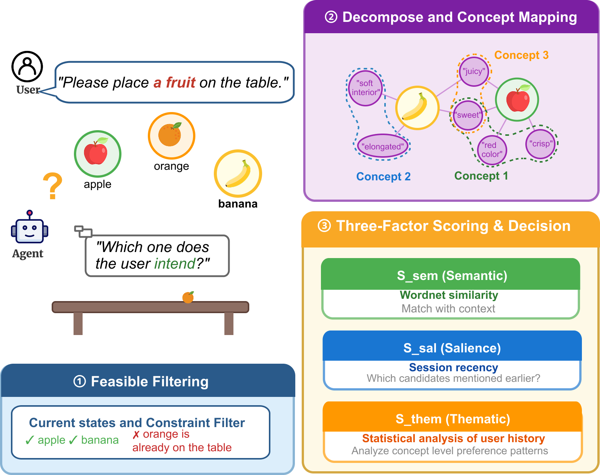
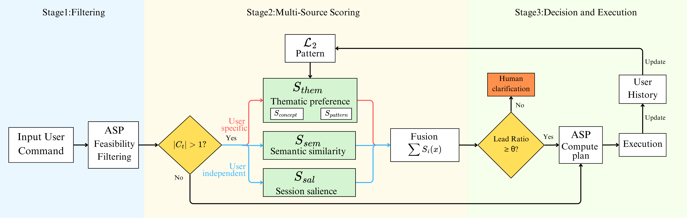
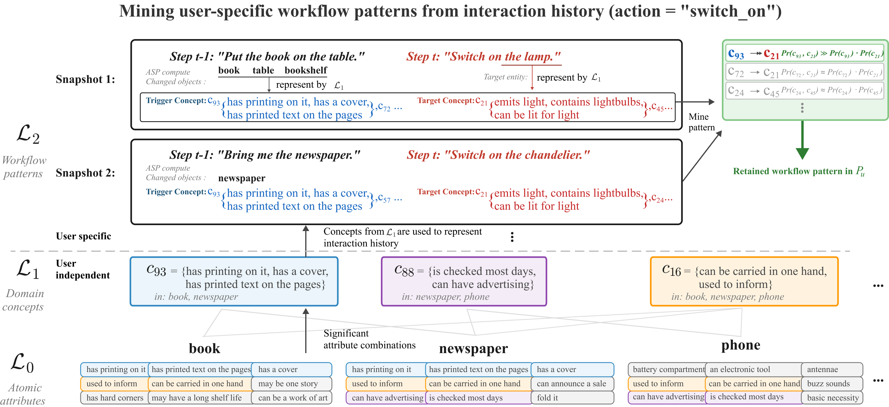

# Hierarchical Compositionality for An Assistive AI Agent





## Environment Requirements

* Python: 3.8 or higher
* Java: 11 or higher
* clingo: 5.7.1 or higher

## How to Run the Framework

### 1. Installing Dependencies

```
pip install -r requirements.txt
python -c "import nltk; nltk.download('wordnet')"
conda install -c potassco clingo
```

### 2. Configure the System

Set your API key:

```
export OPENAI_API_KEY="Replace with your OpenAI API key"
```

### 3. Run the Experiments

One user at one ambiguity level, then the whole matrix:

```
python run_all.py --user user1 --level l1
python run_all.py
```

Users are `user1`, `user2`, `user3`, `user4` and
`user5`; levels `l1` through `l4` re-word every command while keeping its
gold reading, from `give me the tableware` down to `give me it`. Results land in
`result/`.

### 4. Run Interactively

```
python main.py
```

When prompted, input an English command and then its ASP-format goal template,
where `__OBJ__` marks the object to resolve. For example:

* `has(user, __OBJ__)`
* `on(coffeetable, __OBJ__)`
* `inside(microwave, __OBJ__)`
* `heated(__OBJ__)`
* `filled(__OBJ__)`

## Dataset

* [NOVA](https://onlinelibrary.wiley.com/doi/pdf/10.1111/tops.70037)
* [WordNet](https://wordnet.princeton.edu/)

## Tools

* [SPARC](https://github.com/iensen/sparc)
* [spaCy `en_core_web_sm`](https://spacy.io/models/en)
